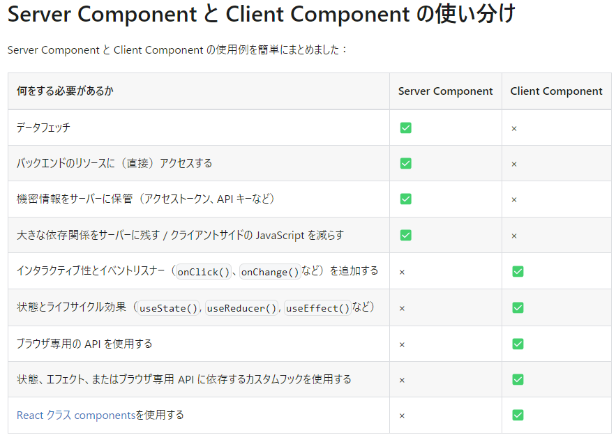

# _Notebooks_

更新日時： 24/7/12 18:19  
コース：12

マークダウンのプレビュー  
_Control + K → V_

# プロジェクト概要

## 使用技術

## _reference_

Udemy：[Next.js 13 App Router による次世代 Web 開発](https://defidejp.udemy.com/course/nextjs-supabase-app-directory/learn/lecture/37760856#overview)  
Repository：[GitHubRepo](https://github.com/GomaGoma676/nextjs-app-router-supabase)

### _Overview_

- NestedLayout
- Benefit of Server component(js bundle size + streamingHTML)
- Server component + Client component

  - Server component  
    **データ取得、バックエンドに直接アクセス、access tocken, API key を含むサーバーとのやり取り、npm などのパッケージが大きいときは SC を利用する。**
    - サーバーで Rendering されるコンポーネント → js やパッケージは client に送られない
    - Data fetch に async function が使用できる
    - Secure Key が参照（使用）可能※env ファイル内の
    - Browser API が使用不可
    - useState,useEffect が使用不可
    - Event listener(onClick 等)は使用不可
  - Client component  
    **イベントリスナーの使用、useState,useReducer,useEffect,Customhooks の使用、useBrowser API の使用するときは CC を利用する**
    - ブラウザで JS を実行する
    - Data fetch に async function を使用できない  
      useEffect, React-query, SWR, use を使用する必要がある
    - Secure Key を使用不可
    - useState, useEffect 等を使用可
    - Event Listener(onClick 等)を使用可

  

  <u>※ClientComponent に ServerComponent を使用することはできない。  
  ClientComponent の Children として ServerComponent はネストできる</u>

- Data fetching in server component ("force-cache","no-store","revalidate")
  - cache option
    - force-cache <u>Static Rendaring ○</u> (defalut)  
      ビルド時に HTML を生成し、CDN にキャッシュするため、サーバーのデータ変更をリアルタイムに更新しない。  
      ビルド時に生成された HTML は .next>server>app>index.html に格納される。
    - no-store <u>Dynamic Rendaring λ</u>  
      サーバー側の変更を反映する
    - next : {revalidate:10}  
      一定時間たつとリロードし HTML を再生成する
- Static and Dynamic rendering
- Fetch level and segment level cache options
- Dynamic segment and generateStaticParams
- Client side caching in navigation
- Soft and Hard navigation
- Revalidation frequency
- Streaming server rendering with suspense (streamingHTML)  
  SSR の DataFetch が完了しないと HTML を返却しないという問題に対して <u>StreamingHTML</u>で解決する。処理が遅いコンポーネントに対して、<u>コンポーネントレベルで</u>suspence でラップすることで、他のコンポーネントが Client に送られ、必要な JS をハイドレートされ、インタラクティブになり、早く表示できる。
- Re-rendering by router.refresh(Mutation)  
  サーバーコンポーネントでレンダリングされた内容を、ページをリロードせずに最新のものに書き換える。  
  router.refresh()
  useRouter は client コンポーネントでしか利用できない。  
  <u>router.refresh とページ全体のリロードの挙動の違い</u>  
  router.refresh：サーバーサイドの実行（useState で管理する値を保持する）  
  ページ全体のリロード：サーバーサイドとクライアントサイドの実行（useState で管理する値を保持しない）
- gen types in Supabase
- CRUD operation with protected endpoint
- Middleware
  _continue..._

  ## <i>Reference</i>

  ### [一言で理解する React Server Components](https://zenn.dev/uhyo/articles/react-server-components-multi-stage)

  React Server Components は<u>多段階計算</u>  
  ※多段階計算とは  
  「動的にコードを生成してそれを走らせる機構を備えた，計算が複数のステージからなる意味論を備えた体系」→「プログラムを生成するプログラム」  
  RSC は「サーバー側」も「クライアント側」も React コンポーネントとして記述される。  
  2 段階の計算の場合は「stage 0 のプログラム（Server）」と「stage 1 のプログラム（Client）」がある。

  - Stage0 の実行タイミング（ビルド時 or リクエスト時）

    | ページの種類                 | stage0 の実行 | stage1 の実行  |
    | ---------------------------- | ------------- | -------------- |
    | リクエストの情報に依存しない | ビルド時      | クライアント側 |
    | リクエストの情報に依存する   | リクエスト時  | クライアント側 |

  - RSC 導入後の SSR とは、「サーバーサイドでも stage 1 の実行を行い、生成された HTML をレスポンスに埋め込んで返すこと」

    | ページの種類       | サーバー側                 | クライアント側 |
    | ------------------ | -------------------------- | -------------- |
    | 従来型（SSR なし） | -------                    | stage1         |
    | 従来型（SSR あり） | stage1                     | stage1         |
    | RSC（SSR なし）    | stage0                     | stage1         |
    | RSC（SSR あり）    | <u>**stage0 + stage1**</u> | stage1         |

  **UX のためにはクライアントサイドの JavaScript が必要だが、UX に関係ない部分はサーバーサイドで処理したほうが良い。**
