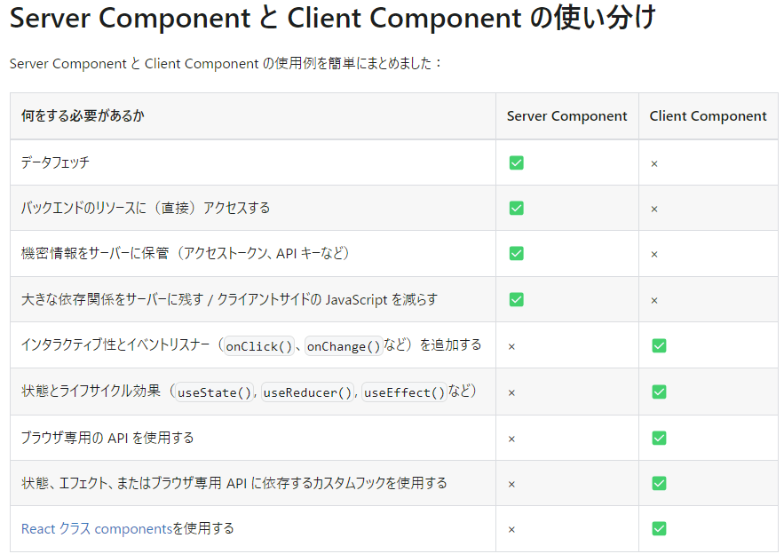
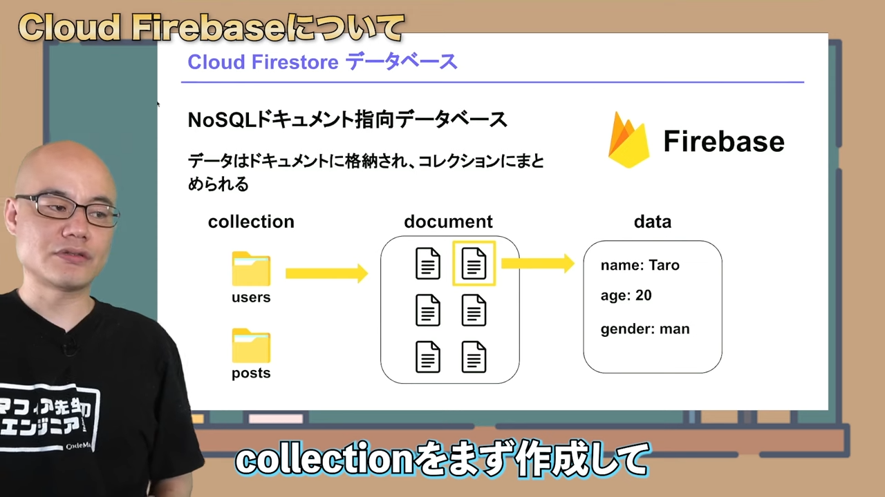

# _Notebooks_

更新日時： 24/7/26 14:30  
コース：17 実装途中(ダイナミックセグメント前まで)でエラー原因がコードなのか Supabase のテーブル設定なのか不明
※16 と 17 は Subabase と Zustand が分からないので、学習し次第戻る

マークダウンのプレビュ  
_Control + K → V_

ルートハンドラは app ディレクトリ内の route.js|ts ファイルで定義されます。  
Next.js の Server Actions は、フォーム送信などのクライアントサイドのイベントから、サーバーサイドの処理を直接呼び出す機能です。クライアント側とサーバー側の処理が同じファイルに書ける。簡略化された。

[マークダウン記法　チートシート](https://qiita.com/kamorits/items/6f342da395ad57468ae3)

# プロジェクト概要

## 使用技術

## _reference_

Udemy：[Next.js 13 App Router による次世代 Web 開発](https://defidejp.udemy.com/course/nextjs-supabase-app-directory/learn/lecture/37760856#overview)  
Repository：[GitHubRepo](https://github.com/GomaGoma676/nextjs-app-router-supabase)

### _Overview_

- NestedLayout  
  app ディレクトリにネストされたフォルダ（page.tsx と layout.tsx）は、layout を累積して表示する
- Benefit of Server component(js bundle size + streamingHTML)
  - UI の非インタラクティブな部分をサーバーコンポーネントに閉じることで、クライアント側に送る JS の量を減らすことができる。ブラウザーがダウンロード、解析、実行するクライアント側 JavaScript が少なくなるため、インターネット速度が遅いユーザーや性能の低いデバイスを使用するユーザーにとって有益。
  - レンダリング作業をチャンク（断片）に分割し、準備できたらクライアント側にストリーミングできる。これにより、ユーザーはページが全体がレンダリングされるのを待たずに利用できる。
- Server component + Client component
  

  - Server component  
    **データ取得、バックエンドに直接アクセス、access tocken, API key を含むサーバーとのやり取り、npm などのパッケージが大きいときは SC を利用する。**
    - サーバーで Rendering されるコンポーネント → js やパッケージは client に送られない
    - Data fetch に async function が使用できる
    - Secure Key が参照（使用）可能※env ファイル内の
    - Browser API が使用不可
    - useState,useEffect が使用不可
    - Event listener(onClick 等)は使用不可
  - Client component  
    **イベントリスナーの使用、useState,useReducer,useEffect,Customhooks の使用、useBrowser API の使用するときは CC を利用する**
    - ブラウザで JS を実行する
    - Data fetch に async function を使用できない  
      useEffect, React-query, SWR, use を使用する必要がある
    - Secure Key を使用不可
    - useState, useEffect 等を使用可
    - Event Listener(onClick 等)を使用可

  <u>※ClientComponent に ServerComponent を使用することはできない。  
   ClientComponent の Children として ServerComponent はネストできる</u>

- Data fetching in server component ("force-cache","no-store","revalidate")
  - cache option
    - force-cache <u>Static Rendaring ○</u> (defalut)  
      ビルド時に HTML を生成し、CDN にキャッシュするため、サーバーのデータ変更をリアルタイムに更新しない。  
      ビルド時に生成された HTML は .next>server>app>index.html に格納される。
    - next : {revalidate:10} <u>Static Rendaring ○</u>  
      一定時間たつとリロードし HTML を再生成する
    - no-store <u>Dynamic Rendaring λ</u>  
      サーバー側の変更を反映する
- Static and Dynamic rendering
  - Static rendering ≒ 従来の SSG（revalidate なし）や ISR（revalidate あり）相当で build 時や revalidate 実行後にレンダリング  
    <i>静的レンダリングは、静的なブログ投稿や製品ページなど、データのない UI やユーザー間で共有されるデータには便利。</i>  
    <u>ビルド時 (デプロイ時) またはデータの再検証時</u>にサーバー上で行う。
    - より高速な Web サイト：事前にレンダリングされたコンテンツをキャッシュ
    - サーバー負荷の軽減：リクエストごとにコンテンツを動的に生成する必要なし
    - SEO：検索エンジンのクローラーがインデックスを作成
  - Dynamic rendering ≒ 従来の SSR 相当でリクエストごとにレンダリング  
    <i>動的レンダリングは、データが頻繁に更新されるページやユーザー独自のページにアクセスするとき、リクエスト時の情報を必要とするページには便利。</i>  
    <u>リクエスト時(ユーザーがページにアクセスしたとき)</u>に各ユーザーのコンテンツがサーバー上でレンダリング。
    - リアルタイムデータ：アプリケーションはリアルタイムのデータや頻繁に更新されるデータを表示
    - ユーザー固有のコンテンツ：パーソナライズされたコンテンツを提供し、ユーザーの操作に基づいてデータを更新する
    - リクエスト時の情報：Cookie や URL 検索パラメータなど、リクエスト時にのみ知ることができる情報にアクセスできる
- Fetch level and segment level cache options  
  参考資料：[Data Fetching, Caching, and Revalidating](https://nextjs.org/docs/app/building-your-application/data-fetching/fetching-caching-and-revalidating)

  - force-cache:デフォルトは fetch で返された値をサーバーのデータキャッシュに格納される。  
    ※ **ServerAction 内と POST メソッドが使用されたルートハンドラ**では、fetch されたデータがキャッシュされない。
  - revalidate
    データの再検証と呼ばれる。データ キャッシュを消去し、最新のデータを再取得するプロセス。 種類は、時間ベースの再検証とオンデマンド再検証（手動で再検証）がある。
  - no-store:データキャッシュのオプトアウト（オプトアウト：不参加や脱退の意）キャッシュされない。

- Dynamic segment and generateStaticParams
  - Dynamic segment  
    セグメント：app フォルダ配下の blogs フォルダや nested-layout フォルダのこと  
    動的セグメント：[blogId]フォルダのようにコンテンツの中身だけを変更し、path も各々で変更させるときに使用する」
  - generateStaticParams  
    Dynamic segment では、固有のパラメータごとに Dynamic Rendering するが、事前にパラメータ（id）を取得し、Static Rendering しておくことができる。
- Client side caching in navigation

- Soft and Hard navigation

  - Soft navigation  
    一度 fetch したデータをクライアントサイドでキャッシュしておくこと。  
    ソフトナビゲージョンはサーバーサイドの変化を反映しない。
    これは、Dynamic Rendering を採用しているページであっても、 ソフトナビゲーションの際は変更しないことを意味する。
  - Hard navigation  
    Page に遷移したタイミング毎度サーバーの変更を取り込むこと。  
    UseRouter.push で遷移してきた時は、ハードナビゲーションが行われる。  
    ※**Next.js version 13.4 以降は router.push の初回だけ Hard Navigation で、二回目以降は Soft Navigation になる**

    ※**Dynamic Segment の際は、ダイナミックセグメントのパラメーター（id）が変更されるたびに Hard Navigatioin が走る**

    ※**Dynamic Segment の中身だけでなく、入れ子構造担っている Navbar などにも変更を適応したいときは、router.refresh を利用する**

- Revalidation frequency
- Streaming Server Rendering with suspense (streamingHTML)  
  Streaming HTML は、サーバーが HTML を小さな部分（チャンク）に分割して順番にブラウザに送信する技術。  
  SSR（Dynamic Rendering） の DataFetch が完了しないと HTML を返却しないという問題に対して <u>StreamingHTML</u>で解決する。処理が遅いコンポーネントを待たずに流れるようにクライアントに送られる。コンポーネントが Client に送られ、順次、ハイドレートされ、インタラクティブになり、早く表示できる。<u>コンポーネントレベルで</u>suspence でラップすることで、loading も表示できる。  
  **ページレベルは `loading.tsx`を使用し、特定のコンポーネントは<`Suspense`>を使用する**
- Re-rendering by router.refresh(Mutation)  
  サーバーコンポーネントでレンダリングされた内容を、ページをリロードせずに最新のものに書き換える。  
  router.refresh()
  useRouter は client コンポーネントでしか利用できない。  
  <u>router.refresh とページ全体のリロードの挙動の違い</u>  
  router.refresh：サーバーサイドの実行（useState で管理する値を保持する）  
  ページ全体のリロード：サーバーサイドとクライアントサイドの実行（useState で管理する値を保持しない）
- gen types in Supabase  
  型の自動生成
- CRUD operation with protected endpoint  
  C(CREATE)  
  R(READ)  
  U(UPDATE)  
  D(DELETE)  
  Supabase で Row Level Security を実装しているときは、認証を通さないと CRUD 操作ができなくなっている。

  - endpoint protection  
    CREATE UPDATE DELETE は ClientComponent 経由で行われる。ブラウザからログインしたときのアクセストークンがクライアント側に付与されていることで、SupabaseAPI によってクライアントコンポーネントの CUD 操作に自動的にアクセストークンが自動付与されるので、認証が容易。

    しかし、ServerComponent 経由で行われる READ 操作は、クライアント側で保持しているアクセストークンをサーバーコンポーネントに付与する必要がある。これには Headers を用いる。

    アクセストークンとは：**Web サービスを利用するために、認証局がユーザーを認証するために払い出した認証情報。**

    アクセストークン認証とは：**一度入力したメールアドレスなどのログイン ID やパスワードを各認証ページに引き継ぐこと、つまり、アクセスの度にログイン ID やパスワードを通信させ使用することは、セキュリティの観点からは危険なため、認証局は初回ログイン以降にユーザーを認証するための、「アクセストークン」を払い出し、初回ログイン以降は、払い出した「アクセストークン」でユーザーを認証すること**

  - Sync(同期) Server and Client access token  
    異なるユーザーがログインしたとき、Client 側のアクセストークンが更新され、Server 側のアクセストークンと異なる。このとき、どのようにアクセストークンを同期させるか。
    1. User がログインする
    2. Client と Server のトークンを比較する
    3. もし異なるのであれば、サーバーコンポーネントを走らせて、クライアントから新しいトークンを取得する。
  - Global State
  - payload 通信データの本体

- Middleware
  ログアウトした状態で URL にアクセスした際に、ログイン画面にリダイレクトするもの

  ## <i>Reference</i>

  ### [一言で理解する React Server Components](https://zenn.dev/uhyo/articles/react-server-components-multi-stage)

  React Server Components は<u>多段階計算</u>  
   ※多段階計算とは  
   「動的にコードを生成してそれを走らせる機構を備えた，計算が複数のステージからなる意味論を備えた体系」→「プログラムを生成するプログラム」  
   RSC は「サーバー側」も「クライアント側」も React コンポーネントとして記述される。  
   2 段階の計算の場合は「stage 0 のプログラム（Server）」と「stage 1 のプログラム（Client）」がある。

  - Stage0 の実行タイミング（ビルド時 or リクエスト時）

    | ページの種類                 | stage0 の実行 | stage1 の実行  |
    | ---------------------------- | ------------- | -------------- |
    | リクエストの情報に依存しない | ビルド時      | クライアント側 |
    | リクエストの情報に依存する   | リクエスト時  | クライアント側 |

  - RSC 導入後の SSR とは、「サーバーサイドでも stage 1 の実行を行い、生成された HTML をレスポンスに埋め込んで返すこと」

    | ページの種類       | サーバー側                 | クライアント側 |
    | ------------------ | -------------------------- | -------------- |
    | 従来型（SSR なし） | -------                    | stage1         |
    | 従来型（SSR あり） | stage1                     | stage1         |
    | RSC（SSR なし）    | stage0                     | stage1         |
    | RSC（SSR あり）    | <u>**stage0 + stage1**</u> | stage1         |

  **UX のためにはクライアントサイドの JavaScript が必要だが、UX に関係ない部分はサーバーサイドで処理したほうが良い。**

  ### [React Server Components を理解したい](https://zenn.dev/yuu104/articles/react-server-component)

  <u>Web ページのパフォーマンス指標</u>

  1. FCP(First Contentful Paint)

  - ブラウザが最初のテキストや画像などのコンテンツを描画するまでの時間
  - 真っ白な画面ではなく、何かしらの表示（レイアウトなど）がある状態

  2. LCP(Largest Contentful Paint)

  - ページの主要なコンテンツが表示されるまでの時間
  - ユーザが関心のあるコンテンツが含まれている
  - DB からデータを取得し、UI にレンダリングされた状態

  3. TTI(Time to Interractive)

  - ページが完全にインタラクティブになるまでの時間
  - React がダウンロードされ、アプリケーションがレンダリングされ、ハイドレーションが行われる
  - ページ上の UI コンポーネントが反応し始め、ユーザーが入力できる状態

  <u>RSC のメリット</u>

  1. JS のバンドルサイズの削減  
     SC の処理はサーバー側で簡潔するため、SC 用の JS はクライアント側には必要ありません。  
     よって、クライアントに送信する JS バンドルを削減でき、パフォーマンスが向上します。  
     これは、インターネットの速度が遅いユーザーや性能の低いデバイスを使用しているユーザーにとって有益です。
  2. データフェッチスピードの高速化  
     SC 上でデータフェッチする場合、クライアント側でのフェッチと比べると当然データソースへの距離も近くなります。  
     これにより、レンダリングに必要なデータのフェッチにかかる時間が短縮され、クライアントが行うデータリクエストの量も削減できます。
  3. 初期表示の改善  
     Streaming HTML との組み合わせにより、FCP や TTI を改善できます。
  4. セキュリティ  
     トークンや API キーなどの機密データやロジックをサーバだけで完結できます。  
     クライアントへ公開することによるリスクがなくなり、サービスの安全性が向上します。
  5. 設計面のメリット (?)  
     データの取得処理とそのデータを用いた DOM の表現が簡潔になります。

  ### [PPR - pre-rendering 新時代の到来と SSR/SSG 論争の終焉](https://zenn.dev/akfm/articles/nextjs-partial-pre-rendering)

  <u>Partial Pre-Rendering：ページを static rendering としつつ、部分的に dynamic rendering にすることが可能なレンダリングモデル</u>

  0. pre-rendering について  
     参考記事[SSG と SSR で理解する Next.js のページレンダリング](https://zenn.dev/luvmini511/articles/1523113e0dec58)

     SPA：ページをロードする時、まず空の html を読み込んで JS ファイルも読み込んでその JS が画面をレンダリング  
      SPA の問題点 SEO が悪い & ファーストビューが遅い
     この問題に対して NEXT.js はすべてのページを Pre-rendering する。  
      Pre-rendering とは「クライアント側の JS がレンダリングする代わりに、各ページに対して HTML を予め作っておくこと」  
      Pre-rendering によって SEO と TimeToFirstBytes（ブラウザーがページをリクエストしてから、サーバーから最初の情報を受信するまでの時間） が早くなる。

     Pre-rendering によって生成された HTML は、ブラウザにロードされるとき、JS によってインタラクティブになる。（このプロセスを Hydration と呼ぶ）  
      **Pre-rendering には SSR,SSG（ISR も含む）２種類ある。**  
      この Pre-rendering において、外部とデータのやり取りを必要とするとき、

     - **SSR は getServerSideProps 関数(リクエスト時にデータを取得)を使用する**  
        getServerSideProps によって、クライアント側の情報（ユーザー情報）をサーバー側で利用できる。getServerSideProps を使う事で、サーバー側でデータを取得して動的な Web ページが生成できる。
     - **SSG は getStaticProps 関数(ビルド時にデータを取得)を使用する**  
        データがヘッドレス CMS から取得できる場合、データが public にキャッシュされうる（ユーザー固有でない）ときに利用する。

  1. レンダリングモデルの歴史
     - Pages Router 時代  
       SSR、SSG,ISR を対応している NEXT.js がシェアを獲得
     - App Router 登場以降  
       App Router は SSR/SSG/ISR ではなく、static rendering と dynamic rendering という 2 つの概念を使って多くの機能を説明している。  
       <i>Static Rendering</i>従来の SSG や ISR 相当で、build 時や revalidate 実行後にレンダリング  
       <i>Dynamic Rendering</i>従来の SSR 相当で、リクエストごとにレンダリング
     - Streaming SSR  
       Streaming SSR はページのレンダリングの一部を<`Suspense`>で遅延レンダリングにすることが可能で、  
       レンダリングが完了するごとに徐々に結果がクライアントへと送信される。  
       **1 つの HTTP レスポンスで完結**しているので SEO 観点もフォロー
  2. SSG/SSR における静的・動的データの混在  
     ページを構成するのに必要なデータが、静的なデータ（キャッシュ可能）と動的データ(キャッシュ不可能)で混在することがある。  
     (Ex)  
     静的データ（更新頻度が少なく、build 時や revalidate ごとに取得で適当なデータ）  
     動的データ（ログイン情報など）

     このようなケースは、大きく二つの実装パターンが存在する

     1. SSG + Client fetch : ページ自体は SSG にしてクライアントサイドで動的データを fetch する
     2. Streaming SSR : 静的データはキャッシュを使用して高速化しつつ、ページの一部を<`Suspense`>で遅延レンダリングする

        | 観点                  | SSG + Client fetch | Streaming SSR |
        | --------------------- | ------------------ | ------------- |
        | Time To First Bytes   | 有利               | 若干不利      |
        | HTTP ラウンドトリップ | 複数回             | １回          |
        | CDN キャッシュ        | 可能               | 不可          |
        | 実装                  | 冗長になりがち     | シンプル      |

        ※Time To First Bytes:ブラウザーがページをリクエストしてから、サーバーから最初の情報を受信するまでの時間  
        ※HTTP ラウンドトリップ：通信やネットワーク、データ伝送などの分野では、通信相手に信号やデータを発信して、応答が帰ってくるまでの過程、回数  
        ※Client fetch の場合クライアントサイド処理とサーバー側のエンドポイントを繋ぐ処理(API Routes、tRPC、GraphQL など)が必要。すなわち実装が冗長

     **Streaming SSR に SSG が持つ TTFB の速度を持たせたレンダリング手法が PPR**

  3. PPR とは  
     PPR は Streaming SSR をさらに進化させた技術で、<u>ページを static rendering としつつ、部分的に dynamic rendering にすることが可能なレンダリングモデル。 </u>  
     SSG・ISR のページの一部に SSR な部分を組み合わせられるようなイメージ、あるいは Streaming SSR のスケルトン部分を SSG/ISR にするイメージ。
     | 観点 |Partial Pre-Rendering| SSG + Client fetch | Streaming SSR |
     | --------------------- |----------| ------------------ | ------------- |
     | Time To First Bytes |有利| 有利 | 若干不利 |
     | HTTP ラウンドトリップ |１回| 複数回 | １回 |
     | CDN キャッシュ |不可| 可能 | 不可 |
     | 実装 |シンプル| 冗長になりがち | シンプル |
     PPR では、SSG+Client fetch 相当の TTFB と実装のシンプルさ、かつ Streaming SSR 同様、HTTP ラウンドドリップも１度で完結する。どちらものメリットを併せ持つ。HTML 内に動的な要素が含まれるため CDN キャッシュは不可。
  4. PPR のデメリット考察

  - PPR は画面の静的化された部分については返してしまうため、ページの HTTP Status は必ず 200 になる。
  - static rendering で完結できるならその方が良い  
    dynamic rendering を含むページでも PPR なら TTFB を SSG に近づけることが可能。しかし、パフォーマンスというのは TTFB だけで測るものではありません。例えば Time to Interactive においては PPR でも SSR でも大きくは変わらないため、ページ全体を SSG にできるならその方が有利でしょう。

  ### 認証の仕組み

  HTTP 通信はステートレス（状態をもたない）ので、
  ログインを実現するためには、**Cookie を使ったセッション管理が必要**

  - session:サーバー側で一時的に保持している情報  
    例：sessionID を発行して、情報に紐づける。session の方が安全
  - cookie:テキスト情報をブラウザ側で一時的に保持している機能  
    例：ログイン情報、カート機能、広告の最適化（サードパーティ Cookie）
  - キャッシュ：閲覧したページをブラウザで保存  
    スーパーリロードでキャッシュを削除できる。

### [Firebase vs Supabase](https://www.youtube.com/watch?v=4iQL1oi6F18)

- Firebase  
  Google が提供している Web・モバイルのためのプラットフォーム。  
  Backend as a Service→ バックエンドの環境構築の実装不要。開発コスト削減。
  - Cloud Firestore:NoSQL（Not only SQL）のデータベース
  - Firebase Analytics:アクセス分析
  - Firebase Hosting:ホスティングサービス
  - Firebase Authentication:認証機能
  - Cloud Storage for Firebase:写真や動画の保存管理
  - Firebase Cloud Message:メッセージング機能
- Supabase  
  シンガポールを拠点にするスタートアップ企業によって提供される BaaS
  - BaaS で Firebase の代替として注目を集める
  - オープンソースなので自分で用意したサーバーにデプロイ可能
  - Firebase 同様にデータベース、認証、ストレージ機能などを提供
  - PostgresSQL（RDBMS）を採用している
- NoSQL vs RDBMS

  - NoSQL
    - スキーマを定義する必要がない
    - 処理が高速
    - 単純なデータを扱いやすい  
      ↓
    - 複雑なデータ処理が苦手
    - データの一貫性や整合性が保証されない  
      （NoSQL のイメージ）  
       
  - RDBMS はデータを厳格に扱いたいときに便利

    - 複雑なデータ処理が行える
    - データ処理に一貫性、整合性がある
    - 一般的には NoSQL より低速
    - 学習コストがかかる

- Firebase と Supabase の比較
  | | Firebase | Supabase |
  | :------------------- | :-------------------: | :----------------------: |
  | 機能の種類 | 　　 優 | 劣 |
  | データベース | NoSQL（ドキュメント） | PostgresSQL |
  | 処理速度 | 優 | 劣 |
  | 処理の一貫性・整合性 | 劣 | 優 |
  | 向いている処理 | 単純な処理で大規模 | 決済処理などの複雑な処理 |
  | 学習コスト | 低い | 高い |
